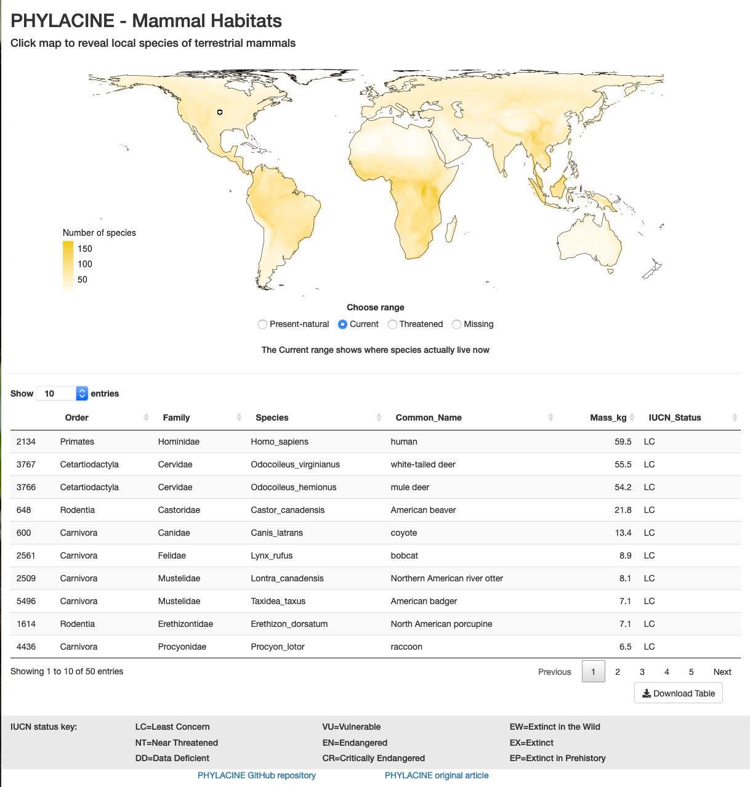

# Phylacine Clickmap

> Clickmap is an interactive shiny app that shows which species of land-living mammals exist 
or could exist at any user-defined geographical location.

> All data used in Clickmap is from the PHYLACINE database which can be found [here](https://github.com/MegaPast2Future/PHYLACINE_1.2) and read about [here](https://doi.org/10.1002/ecy.2443).

> This repo also contains several helping scripts that were used to perpare data for the clickmap app, but are not needed for it to run

***Example image:***

